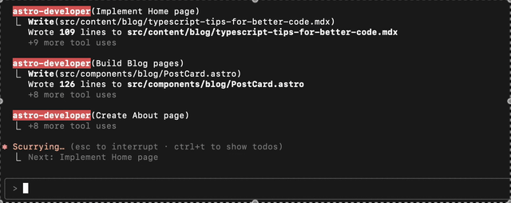
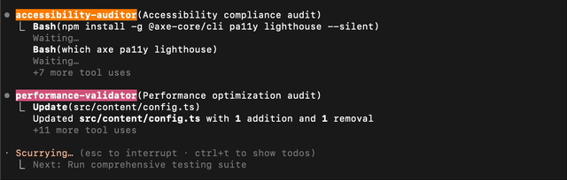
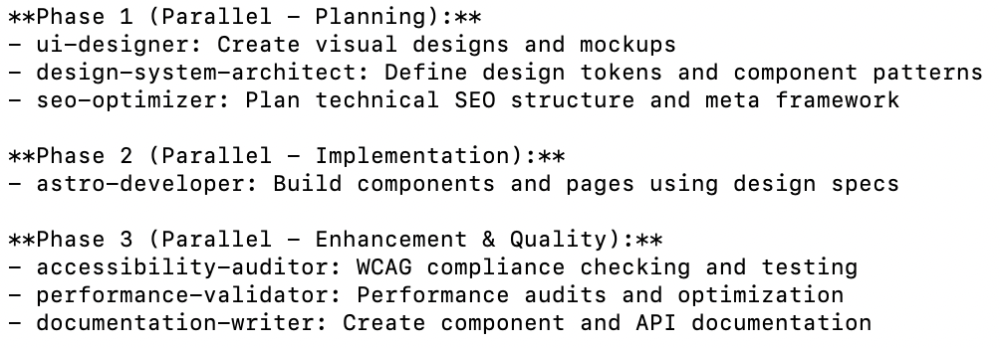
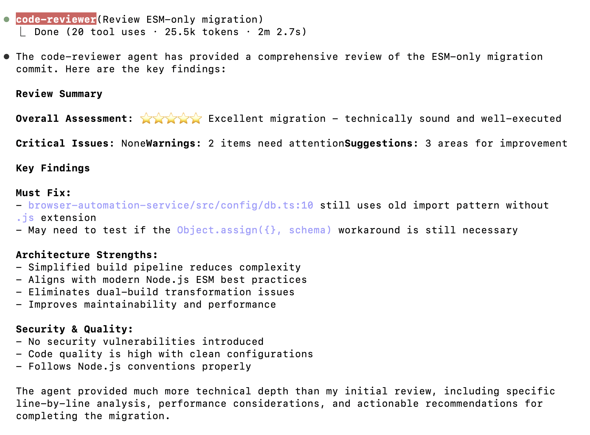
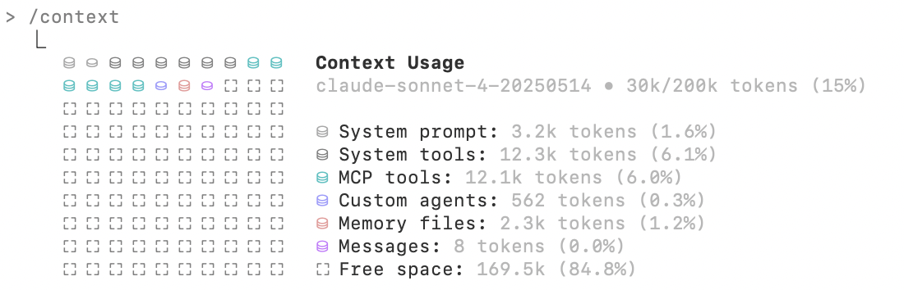
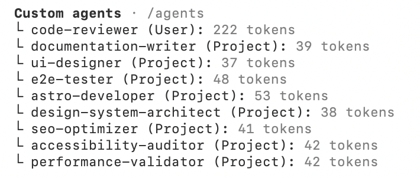

Claude Code custom subagents let you break down work into specialized helpers with their own instructions, tools, and context windows. Instead of stuffing everything into one giant prompt, you can define agents for specific roles and let them collaborate.

This post starts with how to set them up, then dives into advanced features, orchestration patterns, and the pitfalls to avoid.

If you prefer video content, I gave a talk at a local meetup covering these concepts: [**Claude Code Subagents: From Basics to Advanced Workflows**](https://www.youtube.com/watch?v=HI8PBSPr6Qk). The talk covers the foundational concepts and then explores the advanced strategies detailed in this post.

---

## Setting Up Custom Agents

Creating agents in Claude Code is straightforward:

- Run `/agents` in Claude Code to create one.
- Give it a **clear role** (e.g., reviewer, tester, doc writer).
- Define the **system prompt** with scope, criteria, and tone.
- Limit its **tools/permissions** to what's necessary.
- Keep context small—prefer summaries and file lists over raw dumps.

This keeps the agent lightweight, predictable, and reusable.

---

## Advanced Features of Custom Agents

Once you've mastered setup, you can start pushing agents further.

### Parallel Execution

You can run several agents at once, each on a discrete part of a problem.

In this image, the astro-developer subagent was able to create several web pages at once.
Because the work doesn't overlap, results return faster without the subagents stepping on each other.

Here's an example of **multiple sub-agents running in parallel**:

---

### Serial Workflows

Some tasks need sequential execution. A debugging agent might identify causes, then hand off to a testing agent, then finally to a builder agent for patching. You can define these workflows in your `CLAUDE.md`, in each agent's description, or with an orchestration agent.

---

### Auto-Activation

Well-written descriptions allow Claude to **auto-trigger** agents when relevant. For example, asking for "SEO improvements" can automatically summon your `seo-optimizer` agent without manual activation.

---

### Domain-Specific Agents

Agents can specialize in:

- **Code review** (security, performance, style).
- **UI/UX design checks** with accessibility rules baked in.
- **Performance validation** (load testing, bundle size audits).
- **End-to-end testing** with MCP integrations like Playwright.

Here's an example of a code reviewer subagent in action:

---

## Pitfalls and Gotchas

As powerful as custom agents are, they aren't free from trade-offs.

- **Token Costs:**
  Each agent consumes tokens for its context and replies. In a complex workflow with 6–8 agents, that adds up fast. Be intentional—don't spin up agents you don't need.

- **Context Pollution:**
  Overloading an agent with too much irrelevant data leads to hallucinations. Keep prompts short, scope narrow, and context lean.

- **Overlapping Roles:**
  Two agents trying to do the same job (like two builders editing at once) can cause conflicts. Assign one job per agent and coordinate writes.

- **Hidden Dependencies in Parallel Runs:**
  Running tasks in parallel only works if they're independent. If one depends on another, you'll get inconsistent outputs.

- **Maintenance Overhead:**
  Agents are reusable but still require upkeep. Outdated instructions or stale context files can lead to incorrect assumptions.

---

## Example: A Multi-Agent Project Setup

Here's a snapshot of custom agents from a real project:

- `code-reviewer (User)` – 222 tokens
- `documentation-writer (Project)` – 39 tokens
- `ui-designer (Project)` – 37 tokens
- `e2e-tester (Project)` – 48 tokens
- `astro-developer (Project)` – 53 tokens
- `seo-optimizer (Project)` – 41 tokens
- `accessibility-auditor (Project)` – 42 tokens
- `performance-validator (Project)` – 42 tokens

Notice how each has a specific role and relatively low token footprint—except for the user-configured reviewer, which is much heavier.

---

## Key Takeaways

- **Start small**: one role, one job, minimal context.
- **Scale smart**: add agents only when they reduce friction.
- **Guard your context**: shorter prompts outperform bloated ones.
- **Mind the cost**: tokens = money + context space.
- **Automate carefully**: parallelize safe tasks, sequence risky ones.

Custom agents give Claude Code the ability to work like a real team—specialized, predictable, and collaborative. When used well, they extend your reach without burning tokens or introducing chaos.

---

## Resources

- [Claude Code Docs: Sub-Agents](https://docs.anthropic.com/en/docs/claude-code/sub-agents)
- [ClaudeLog Blog](https://claudelog.com/)
- [MCP Servers for Custom Tools](https://docs.anthropic.com/en/docs/mcp)

---

Have you tried building workflows with custom agents? Share your stories—I'd love to compare setups and learn what's working for other developers.
